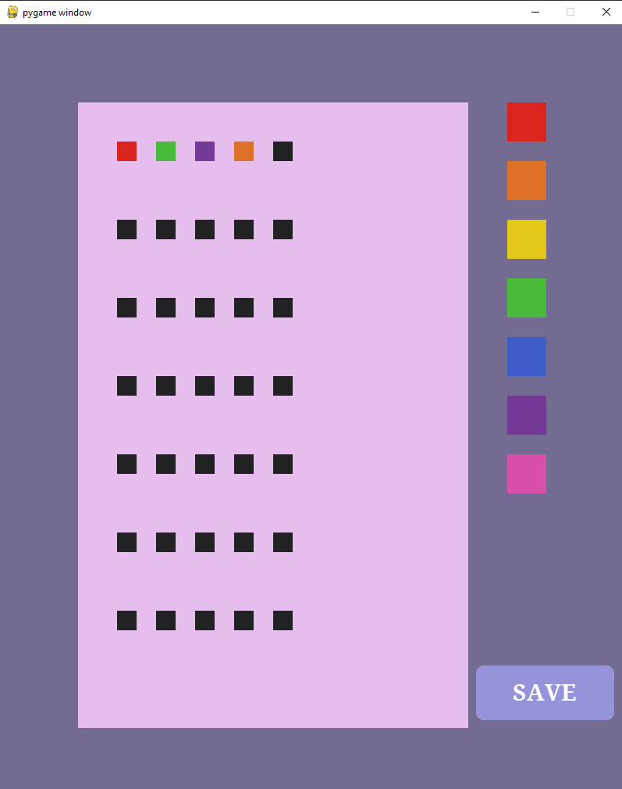
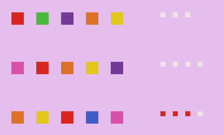

# MastermindPython

A simple game of Mastermind made with Pygame.

## How to play
The gameplay consists of trying to guess the password which is five colors set in a specific way.
There are two game modes: easy and hard. In easy, there's no doubles in password, it consists of five different colors, in hard each color can appear two times.

To play user must click "play" and then choose the difficulty. Next, they select colors from the color picker on the right and put the colors they want.

When the row is completed the game will show the results of this row, each red pin meaning there is one color that is in the exact spot it needs to be and every white means there is a color that is right but is in the wrong spot.

When the password is guessed the game will present the player with a victory screen, if the player runs out of rows and does not guess the password, the game will end and the lose screen will appear.

## Table of contents

- main.py: where the main loop of the game is
- game.py: contains the class Game which consists of loading and ending of the game, keeping up with the score and generating the password
- scripts.py: contains the class Draw which is responsible for drawing the game
- mechanics.py: contains the class BodyAndMind which contains all the clickable objects (Body) and the mechanics of clicking anything (Mind)
- save_file.txt: contains the save file after clicking the button "save" during the game //default: empty easy game
- pngs: contains all the pngs used in the game

